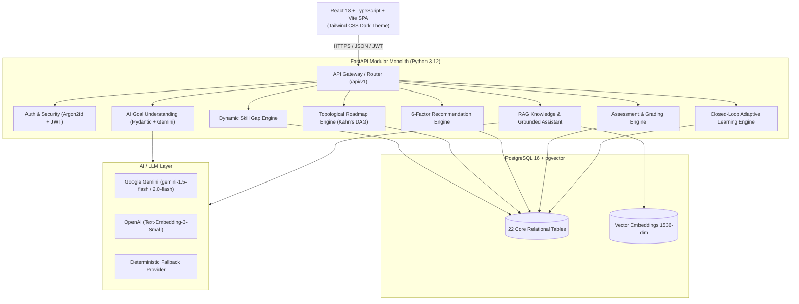

# PathFinder Nexus — Autonomous Adaptive Learning Navigation Platform

[](https://fastapi.tiangolo.com)
[](https://reactjs.org)
[](https://www.typescriptlang.org)
[](https://www.postgresql.org)
[](https://github.com/pgvector/pgvector)
[-brightgreen.svg)](https://docs.pytest.org)
[](https://netlify.com)
[](LICENSE)

**PathFinder Nexus** is a production-ready, explainable, dependency-aware, and continuously adaptive career navigation and learning mastery platform. It converts a learner's natural-language ambitions into a mathematically structured topological learning roadmap, grounded educational resources, anti-cheat server-graded assessments, and closed-loop adaptive interventions.

---

## 📑 Table of Contents
1. [Core Architectural Philosophy](#-core-architectural-philosophy)
2. [7 Core Subsystems & Mathematical Engines](#-7-core-subsystems--mathematical-engines)
3. [System Architecture](#-system-architecture)
4. [Database & Entity Relational Model (22 Core Tables)](#-database--entity-relational-model-22-core-tables)
5. [Security & Anti-Cheat Guardrails](#-security--anti-cheat-guardrails)
6. [Cloud Deployment Guide (Netlify + Render)](#-cloud-deployment-guide-netlify--render)
7. [Local Setup & Execution](#-local-setup--execution)
8. [Automated Testing & Benchmarks](#-automated-testing--benchmarks)
9. [Presentation & Video Demo Package](#-presentation--video-demo-package)

---

## 🌟 Core Architectural Philosophy

Unlike static course playlists or hallucination-prone chatbots, PathFinder Nexus operates on a strict separation of concerns:

> **"RAG retrieves. LLMs explain. The Database grounds. Deterministic engines decide."**

* **RAG (pgvector)**: Retrieves verified educational resources and domain curriculum via 1536-dimensional vector similarity.
* **LLMs (Google Gemini 1.5/2.0 Flash)**: Parses natural language input and synthesizes clear, structured explanations.
* **Database (PostgreSQL 16)**: Authoritative single source of truth for canonical roles, skills, and assessment questions.
* **Deterministic Engines**: Strict mathematical algorithms compute skill gaps, topological Kahn's DAG roadmaps, 6-factor rankings, and Bayesian evidence fusion.

---

## 🧠 7 Core Subsystems & Mathematical Engines

### 1. AI Goal Understanding & Grounding Engine
- **Natural Language Parsing**: Ingests free-form ambitions (e.g., *"I want to become an AI Engineer specializing in LLMs in 12 weeks with 2 hours daily"*).
- **Structured Pydantic Validation**: Uses Gemini with strict JSON mode to extract canonical roles, target timelines, daily study budgets, and baseline skills.
- **Zero Hallucination Filter**: Unknown roles are flagged as `AMBIGUOUS` with nearest validated alternatives.

### 2. Dynamic Skill Gap Engine
- **Zero Table Persistence**: Skill gaps are dynamically computed in real-time on query without stale cached tables:
  $$\text{Gap} = \max(\text{RequiredProficiency} - \text{LearnerProficiency}, 0)$$
- **Role Readiness Percentage**:
  $$\text{Readiness Score} = \left(\frac{\sum_{i=1}^n \text{CurrentProficiency}_i \times \text{Importance}_i}{\sum_{i=1}^n \text{RequiredProficiency}_i \times \text{Importance}_i}\right) \times 100$$
- **Classification Status**: `MASTERED` $(\text{Gap} = 0)$, `PARTIAL` $(0 < \text{Gap} < \text{Required})$, `MISSING` $(\text{Current} = 0)$.

### 3. Topological Roadmap Engine (Kahn's DAG Algorithm)
- Constructs a Directed Acyclic Graph (DAG) over skill prerequisites.
- **Mathematical Invariant**: Prerequisite milestones strictly precede dependent topics with zero dependency cycles:
  $$\text{InDegree}(v) = \sum_{(u, v) \in E} 1$$
- Unlocks downstream modules dynamically only when prerequisite competencies reach passing thresholds.

### 4. Normalized 6-Factor Explainable Recommendation Engine
- Scores educational resources across 6 normalized objectives summing strictly to $1.0$:
  $$\text{Score} = 0.30 G + 0.20 P + 0.15 R + 0.15 D + 0.10 T + 0.10 L$$
  - **Gap Severity ($G$, 30%)**: Prioritizes resources targeting the largest deficiency.
  - **Prerequisite Readiness ($P$, 20%)**: Ensures learner has completed necessary foundations.
  - **Goal Alignment ($R$, 15%)**: Matches specific career target role curriculum.
  - **Difficulty Fit ($D$, 15%)**: Matches current experience level.
  - **Time Investment ($T$, 10%)**: Aligns with daily/weekly study budget.
  - **Format Preference ($L$, 10%)**: Balances video, article, and interactive preferences.

### 5. Server-Graded Assessment Engine
- **Anti-Cheat Delivery**: Correct answers and rationales are **never sent to the client browser**.
- **Authoritative Grading**: Submissions are evaluated strictly on the backend with millisecond latency.

### 6. Bayesian Evidence Fusion & Closed-Loop Adaptive Interventions
- **Evidence Fusion Update**:
  $$P_{\text{new}} = \text{round}(0.30 \times P_{\text{old}} + 0.70 \times \text{AssessmentScore}, 2)$$
- **Adaptive Interventions**:
  - **Score $< 40\%$ (Critical Deficiency)**: Locks dependent milestones, generates prerequisite refresher resources, and updates **Next Best Action**.
  - **$40\% \le \text{Score} < 80\%$ (Reinforcement)**: Generates focused practice modules.
  - **$\text{Score} \ge 80\%$ (Mastery)**: Marks milestone completed and unlocks downstream roadmap nodes.

### 7. Grounded RAG Knowledge Assistant
- **pgvector Semantic Search**: 1536-dimensional OpenAI vector embeddings with cosine similarity cutoff ($\ge 0.50$).
- **Anti-Hallucination Guardrails**: Retrieved context is isolated with strict XML delimiters. Every response must cite database-grounded resources.

---

## 🏗️ System Architecture



---

## 🗄️ Database & Entity Relational Model (22 Core Tables)

1. **Authentication & User Profiles**: `users`, `learner_profiles`, `learner_skills`, `user_preferences`.
2. **Canonical Skill Catalog**: `roles`, `skills`, `skill_prerequisites`, `role_skills`.
3. **Curriculum & Roadmaps**: `roadmaps`, `roadmap_items`, `resources`, `resource_skills`, `projects`, `project_skills`.
4. **Assessments & Submissions**: `assessments`, `assessment_questions`, `assessment_submissions`, `submission_answers`.
5. **Conversational Assistant & RAG**: `chat_conversations`, `chat_messages`, `rag_documents`, `audit_logs`.

---

## 🛡️ Security & Anti-Cheat Guardrails

- **Password Security**: Argon2id cryptographic hashing with secure salt generation.
- **Authentication**: Stateless JWT tokens with expiration & client-side revocation.
- **CORS & Middleware**: Dynamic origin validation with regex matching for Netlify deploy previews (`https://*.netlify.app`).
- **Security Headers**: HSTS, Content-Security-Policy, X-Frame-Options (`DENY`), X-Content-Type-Options (`nosniff`).
- **Input Sanitization**: Request body size limits (2MB), rate limiting per endpoint, and prompt injection defense.

---

## 🚀 Cloud Deployment Guide (Netlify + Render)

### 1. Push to GitHub
```bash
git remote set-url origin https://github.com/sumitsharma29/pathfinder.git
git add .
git commit -m "feat: complete PathFinder Nexus production release"
git push -u origin master
```

---

### 2. Deploy Backend & Database on Render
1. Open [Render Dashboard](https://dashboard.render.com) -> Click **New +** -> **Blueprint**.
2. Connect your GitHub repository `sumitsharma29/pathfinder`.
3. Render automatically reads [`render.yaml`](file:///render.yaml) and creates:
   - **PostgreSQL 16 Database** (`pathfinder-db`)
   - **FastAPI Web Service** (`pathfinder-nexus-backend`)
4. Build Command: `pip install -r backend/requirements.txt && python scripts/deploy_init.py`
5. Start Command: `uvicorn backend.app.main:app --host 0.0.0.0 --port $PORT`
6. Copy your live backend URL (e.g., `https://pathfinder-nexus-backend.onrender.com`).

---

### 3. Deploy Frontend SPA on Netlify
1. Open [Netlify Dashboard](https://app.netlify.com) -> Click **Add new site** -> **Import an existing project**.
2. Select your repository `sumitsharma29/pathfinder`.
3. Configure Build Settings:
   - **Base directory**: `frontend`
   - **Build command**: `npm run build`
   - **Publish directory**: `frontend/dist`
4. Set Environment Variable:
   - `VITE_API_URL` = `https://your-backend-service.onrender.com`
5. Click **Deploy Site**.
   *Note: Netlify SPA routing is pre-configured via `public/_redirects` and `netlify.toml` for zero 404s on refresh.*

---

## 💻 Local Setup & Execution

### Prerequisites
- **Python 3.12+**
- **Node.js 20+**
- **PostgreSQL 16+** *(Optional: includes 100% deterministic offline fallback mode)*

### 1. Backend Launch
```bash
# 1. Install dependencies
pip install -r backend/requirements.txt

# 2. Synchronize database schema and seed canonical catalog
python scripts/deploy_init.py

# 3. Start FastAPI server
uvicorn backend.app.main:app --reload --port 8000
```
Swagger API documentation: `http://localhost:8000/docs`

### 2. Frontend Launch
```bash
cd frontend
npm install
npm run dev
```
Open application: `http://localhost:5173`

---

## 🧪 Automated Testing & Benchmarks

```bash
# Run 162 backend unit & integration tests
pytest

# Verify environment diagnostics & pgvector support
python scripts/validate_live_setup.py

# Build frontend production bundle
cd frontend && npm run build
```

**Verification Results**:
- **Pytest**: 162 / 162 Passed (100%)
- **TypeScript**: 0 Errors (`tsc && vite build` passing)

---

## 📁 Presentation & Video Demo Package

All evaluation assets are organized in the [`presentation/`](file:///presentation) folder:

| File | Format | Description |
| :--- | :--- | :--- |
| **`PathFinder_Nexus_Demo_Video.mp4`** | **1080p MP4 Video** | Full video walkthrough with AI voiceover narration & subtitles. |
| **`PathFinder_Nexus_Project_Presentation.pptx`** | **PowerPoint (.pptx)** | 16:9 Widescreen 15-slide PowerPoint deck. |
| **`PathFinder_Nexus_Project_Presentation.pdf`** | **PDF (.pdf)** | High-res landscape presentation document. |
| **`interactive_video_demo.html`** | **Interactive Player** | Browser video demo with real-time Speech Synthesis. |
| **`DEMO_VIDEO_SCRIPT.md`** | **Script** | Second-by-second narration script with timestamps. |

---

## 📄 License
This project is licensed under the MIT License — see the [LICENSE](LICENSE) file for details.
