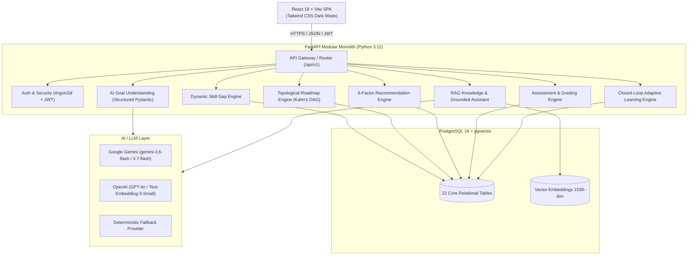

# PathFinder AI — Intelligent Personalized Learning Navigation Platform

[](https://fastapi.tiangolo.com)
[](https://reactjs.org)
[](https://www.postgresql.org)
[]()
[](LICENSE)

**PathFinder AI** is an explainable, dependency-aware, and continuously adaptive learning navigation platform. It converts a learner's natural-language career goals, existing skill portfolio, and learning preferences into an intelligent learning roadmap, grounded educational resources, and server-graded adaptive assessments.

---

## 🌟 Key Highlights & Architectural Principles

Unlike static course aggregators or hallucination-prone chatbots, PathFinder AI operates on a rigorous core philosophy:

> **"RAG retrieves. LLMs explain. The Database grounds. Deterministic engines decide."**

* 🎯 **AI-Powered Goal Extraction**: Analyzes natural-language goals (e.g., *"I want to become an AI Engineer specializing in LLMs"*) and grounds them against canonical career roles with structured Pydantic validation.
* 📊 **Dynamic Skill Gap Engine**: Deterministically computes proficiencies, gaps, and readiness in real time with zero static table persistence:
  $$\text{Gap} = \max(\text{RequiredProficiency} - \text{LearnerProficiency}, 0)$$
* 🧭 **Topological Roadmap Engine**: Constructs prerequisite-aware Directed Acyclic Graphs (DAGs) using Kahn's algorithm, guaranteeing prerequisites strictly precede dependent skills.
* ⚖️ **Normalized 6-Factor Recommendation Engine**: Ranks educational resources using multi-factor transparent scoring (Gap 30%, Prerequisites 20%, Goal 15%, Difficulty 15%, Time 10%, Preference 10%).
* 📝 **Sanitized Assessment & Evidence Fusion**: Delivers sanitized questions with authoritative server-side grading and updates mastery via evidence fusion:
  $$P_{\text{new}} = \text{round}(0.30 \times P_{\text{old}} + 0.70 \times \text{AssessmentScore}, 2)$$
* 🔄 **Closed-Loop Adaptive Engine**: Detects weak skills ($< 40\%$), triggers foundational interventions, unlocks/locks downstream roadmap prerequisites dynamically, and shifts the **Next Best Action**.
* 🤖 **Grounded Learning Assistant**: RAG knowledge retrieval over curated database resources with pgvector cosine similarity, XML security delimiters, and anti-hallucination source citation verification.

---

## 🏗️ System Architecture



---

## 🚀 Quickstart Guide

### Prerequisites
* **Docker & Docker Compose** (Recommended) *OR*
* **Python 3.12+**, **Node.js 20+**, and **PostgreSQL 16+**

---

### Option A: Run with Docker Compose (Recommended)

1. **Clone the repository:**
   ```bash
   git clone https://github.com/your-username/pathfinder-ai.git
   cd pathfinder-ai
   ```

2. **Configure Environment Variables:**
   ```bash
   cp .env.example .env
   ```
   *(Optionally add your `LLM_API_KEY` for Google Gemini or OpenAI)*

3. **Start the application:**
   ```bash
   docker-compose up --build
   ```

4. **Access the application:**
   * 🌐 **Frontend UI**: [http://localhost](http://localhost)
   * 📚 **API Swagger Docs**: [http://localhost:8000/docs](http://localhost:8000/docs)
   * 🩺 **Health Check**: [http://localhost:8000/health](http://localhost:8000/health)

---

### Option B: Local Manual Setup

#### 1. Backend Setup
```bash
# Navigate to project root and create virtual environment
python -m venv venv
source venv/bin/activate  # On Windows: venv\Scripts\activate

# Install Python dependencies
pip install -r backend/requirements.txt

# Run database migrations
alembic upgrade head

# Seed initial curated catalog data (Phase 17)
python scripts/seed.py

# Start FastAPI backend
uvicorn backend.app.main:app --reload --host 0.0.0.0 --port 8000
```

#### 2. Frontend Setup
```bash
# Navigate to frontend directory
cd frontend

# Install Node dependencies
npm install

# Start Vite development server
npm run dev
```
Open [http://localhost:5173](http://localhost:5173) in your browser.

---

## 📡 API Reference Matrix (22 Core Endpoints)

| Category | Method | Endpoint | Description |
|:---|:---|:---|:---|
| **Health** | `GET` | `/health` | Application status and version probe |
| | `GET` | `/health/ready` | Database readiness check |
| **Auth** | `POST` | `/api/v1/auth/register` | Atomic user + learner profile registration |
| | `POST` | `/api/v1/auth/login` | Argon2id credential verification + JWT token |
| | `GET` | `/api/v1/auth/me` | Current authenticated user profile |
| **AI Goal** | `POST` | `/api/v1/ai/analyze-goal` | Natural language goal extraction & role grounding |
| **Profile** | `GET` | `/api/v1/profile` | Learner profile & active preferences |
| | `PATCH` | `/api/v1/profile` | Update target role, study schedule, preferences |
| | `POST` | `/api/v1/profile/skills` | Add/update skill proficiency |
| **Skill Gaps** | `GET` | `/api/v1/skill-gaps` | Real-time dynamic gap analysis for current role |
| **Roadmap** | `POST` | `/api/v1/roadmaps/generate` | Generate topological prerequisite-ordered DAG |
| | `GET` | `/api/v1/roadmaps/current` | Active roadmap and milestone sequence |
| | `POST` | `/api/v1/roadmaps/items/{id}/start` | Transition milestone to `IN_PROGRESS` |
| | `POST` | `/api/v1/roadmaps/items/{id}/complete` | Complete milestone & unlock downstream items |
| **Recommendations** | `GET` | `/api/v1/recommendations` | 6-factor ranked resources with "Why this?" |
| | `POST` | `/api/v1/recommendations/{id}/feedback` | Learner rating & feedback filtering |
| **Assessments** | `GET` | `/api/v1/assessments` | Curated skill assessments list |
| | `GET` | `/api/v1/assessments/{id}` | Sanitized question delivery (no answer keys) |
| | `POST` | `/api/v1/assessments/{id}/submit` | Server-authoritative grading & mastery fusion |
| **Adaptation** | `POST` | `/api/v1/adaptation/evaluate` | Trigger adaptive loop & intervention analysis |
| **Progress** | `GET` | `/api/v1/progress` | Live progress telemetry & milestone analytics |
| | `GET` | `/api/v1/progress/next-action` | Dynamic Next Best Action resolution |
| **Assistant** | `POST` | `/api/v1/assistant/chat` | Grounded RAG chat with source citations |

---

## 🧪 Comprehensive Quality & Testing Suite

PathFinder AI includes a multi-layered automated test suite ensuring total system resilience:

```bash
# Run complete backend test suite (162 tests)
pytest tests/ -v

# Run frontend component & routing tests (17 tests)
cd frontend && npm test

# Run frontend production build check
npm run build

# Validate live database and seed catalog
python scripts/validate_live_setup.py
```

### Test Coverage Highlights
* ✅ **Unit & Mathematical Logic**: Topological DAG sorting, evidence fusion formulas, 6-factor recommendation scoring, fuzzy role grounding.
* ✅ **Security & Threat Mitigation**: Argon2id hashing, IDOR cross-learner isolation, constant-time comparison, XSS sanitization, prompt injection containment.
* ✅ **Lifecycle E2E Journey**: 13-step continuous user journey from registration $\rightarrow$ goal extraction $\rightarrow$ roadmap $\rightarrow$ assessment $\rightarrow$ adaptive intervention $\rightarrow$ AI assistant guidance.

---

## 🎬 Core Demo Walkthrough Scenario

To demonstrate the full intelligence loop:

1. **Register** a new learner account.
2. **Input Natural Language Goal**: *"I want to become an AI/ML Engineer"*.
3. **Inspect Profile & Gaps**: System identifies existing skills (Python: 75%, SQL: 60%) and highlights missing/weak areas (Statistics: 35%, Machine Learning: 30%, Deep Learning: 0%).
4. **Generate Roadmap**: Visual DAG sequences `Python for ML` $\rightarrow$ `Statistics` $\rightarrow$ `Machine Learning` $\rightarrow$ `Deep Learning` $\rightarrow$ `Generative AI` $\rightarrow$ `MLOps`.
5. **Take Assessment**: Complete the *Machine Learning Fundamentals* assessment and score poorly ($< 40\%$).
6. **Trigger Adaptive Recalibration**: System detects the weakness, locks dependent downstream modules, injects targeted foundational interventions, and shifts the **Next Best Action** to foundational statistics.
7. **Ask AI Assistant**: Ask *"Why did my roadmap change?"* — The assistant provides a contextually grounded explanation with direct citations to curated database resources.

---

## 📄 License
This project is licensed under the MIT License — see the [LICENSE](LICENSE) file for details.
